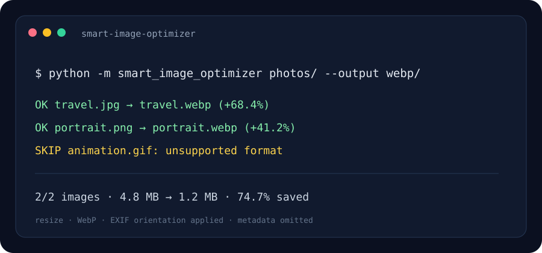

# Smart Image Privacy & Optimizer CLI

A small, auditable command-line tool for preparing still images for the web. It resizes large images, converts them to WebP, applies EXIF orientation before conversion, and reports the resulting size change.

> The image above is an illustrative terminal preview.

## Problem it solves

Camera images often carry GPS coordinates, device details, and other metadata, while their dimensions and file sizes are larger than a page needs. This tool writes a fresh WebP image without copying the source metadata. The source files are never changed.

## Features

- Single-image or directory processing, with optional recursive traversal.
- Maximum width and height with aspect ratio preserved.
- WebP quality control and per-file plus overall size reporting.
- Existing outputs are skipped unless replacement is explicitly requested.
- Animated images are skipped so a multi-frame source is not silently flattened.
- EXIF orientation is applied to the pixels; metadata is not copied to the output.

## Quick start

Requires Python 3.10 or later.

~~~powershell
python -m venv .venv
.venv\Scripts\Activate.ps1
python -m pip install -r requirements.txt
python -m smart_image_optimizer ./photos --output ./optimized --recursive
~~~

On macOS/Linux, activate with: source .venv/bin/activate

Example with tighter dimensions and quality:

~~~powershell
python -m smart_image_optimizer ./photos --output ./web --max-width 1600 --max-height 1200 --quality 80
~~~

## How it works

1. Finds supported still images without modifying the originals.
2. Uses Pillow to correct EXIF orientation and fit the image inside the requested bounds.
3. Encodes a fresh WebP file without passing EXIF, GPS, or other source metadata.
4. Prints a per-file result and total byte savings. A negative percentage means WebP output was larger for that image.

## Project layout

- **smart_image_optimizer/cli.py** — argument parsing, image processing, and reporting.
- **assets/preview.svg** — illustrative terminal preview.
- **requirements.txt** — runtime dependency.

## Tech stack

Python · Pillow · argparse · pathlib

## Privacy and limitations

The output is metadata-light because the encoder receives pixels only; color profiles and other ancillary chunks are not preserved. This is a practical metadata-removal step, not a formal guarantee against every metadata format or steganographic content. Keep originals until you have reviewed the output.

## License

MIT.
